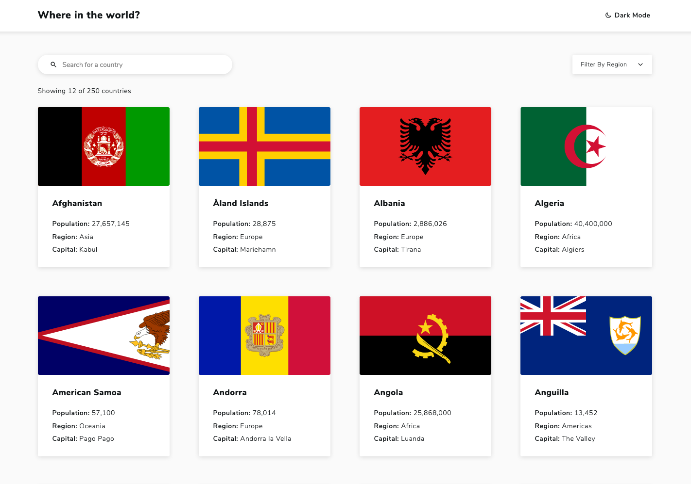

# Worldmark

Live Site URL: [worldmark.netlify.app](https://worldmark.netlify.app/)

## Overview

This is a challenge from [Frontend Mentor](https://www.frontendmentor.io/challenges/rest-countries-api-with-color-theme-switcher-5cacc469fec04111f7b848ca) that pulls data from the [restcountries.com](https://restcountries.com/) API to display data and information about the various countries in the world.

### The Challenge

Users should be able to:

- See all countries from the API on the homepage
- Search for a country using an input field
- Filter countries by region
- Click on a country to see more detailed information on a separate page
- Click through to the border countries on the detail page
- Toggle the color scheme between light and dark

## My Process

I began this project by looking over the provided starter files which included a style guide as well as mobile and desktop previews of the site. I went with a desktop-first approach, and as I was wrting out the HTML I tried to keep in mind how it would look like on smaller screen sizes to get a better idea of how to structure things. I also setup my CSS variables since I would need them to implement a dark mode.

Once the data was pulled from the API and the card components were built, I went about implementing the search and dropdown filter. I wanted these components to work synergistically, so that if the user were to filter by a region AND enter something in the search bar, the data would take both into account. To make this possible, I kept one piece of state for the search matches and another one for the dropdown, then rendered countries based on those that met both criteria. I would later go on to incorporate React Router and build the details pages for each country, thus completing the challenge.

## Scaling the Project

While the requirements for the challenge were satisfied, I couldn't help but feel like there was a lot of data left unused from the API. I thought the best improvement would be to revamp the filter dropdown component and allow users to filter the results based on a larger selection of criteria.

As it stood, you could pick one single major region such as Europe and view all the countries from Europe. I strived to program it so you could select a combination of regions, as well as subregions. So, for example, you could view all the countries from Europe, Western Africa, Southern America, and Central Asia, among many other combinations. This was quite the challenge as I had to handle various edge cases like when all subregions are checked, or a subregion is checked while its parent region is checked, etc. However, through enough trial & error, and taking it one step at a time, I was able to do it. On top of this, I added sort functionality as well as some more filters by rather unique criteria:

- UN Member (yes/no)
- Landlocked (yes/no)
- Driving side (left/right)

The next major thing I wanted to incorporate had to do with optimizing performance. The official challenge asked to allow users to view all countries on the homepage. With 250 countries, and therefore 250 images, doing this without some type of lazy loading seemed unthinkable. While I initially liked the idea of revealing images on scroll, there was a glaring problem. If the user began searching for a country or toggled a filter, the site would have to load all those matched countries at the same time. Also, if they remove their search or filters, the site goes right back to loading all the countries. With this in mind, I decided the best solution was to go with simple pagination and limit the number of countries displayed per page. Should the user want to see more countries per page, I added a range slider to change the amount in the filter menu.

### Built with

- HTML5
- SCSS
- React.js
- [Immer](https://github.com/immerjs/immer)

## Author

- Website - [Mehdi Sajedi](https://mehdisajedi.com/)
